# TerraX DRP — Data Flow

> **Version:** 1.0 | **Date:** 2026-04-07
> **Source:** Derived from `architecture.md`, `API-DOCS.md`, `business-rules.md`
> **Purpose:** Mô tả luồng dữ liệu từ nguồn đầu vào → qua các lớp xử lý → đến đầu ra cuối cùng. Dùng cho dev backend, DBA, và QA kiểm tra tính toàn vẹn dữ liệu.

---

## Mục lục

1. [Tổng quan Data Flow](#1-tổng-quan-data-flow)
2. [Master Data — Từ Excel đến PostgreSQL](#2-master-data--từ-excel-đến-postgresql)
3. [Inventory Data — Từ Excel đến DB (Idempotent)](#3-inventory-data--từ-excel-đến-db-idempotent)
4. [DRP Compute — Từ DB đến DRP Results](#4-drp-compute--từ-db-đến-drp-results)
5. [Pull Order — Từ DRP Result đến Approved Order](#5-pull-order--từ-drp-result-đến-approved-order)
6. [Audit Trail — Mọi mutation đều được ghi](#6-audit-trail--mọi-mutation-đều-được-ghi)
7. [Data Model Relationships](#7-data-model-relationships)
8. [Data Validation Rules](#8-data-validation-rules)
9. [Data Lifecycle — Vòng đời dữ liệu](#9-data-lifecycle--vòng-đời-dữ-liệu)

---

## 1. Tổng quan Data Flow

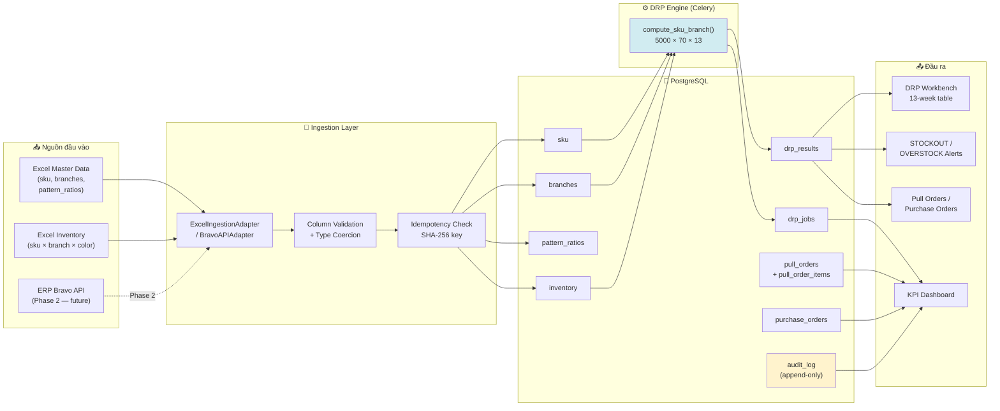

---

## 2. Master Data — Từ Excel đến PostgreSQL

### Input Format

| Sheet | Cột bắt buộc | Cột tùy chọn |
|-------|-------------|--------------|
| `sku` | `sku_code`, `sku_name`, `pattern_group`, `pattern_role`, `demand_mean`, `demand_std`, `unit`, `weight_kg` | — |
| `branches` | `code`, `name`, `type` (NM/CN), `region`, `lead_days` | — |
| `pattern_ratios` | `pattern_group`, `factory_code`, `main_qty`, `border_qty`, `point_qty`, `effective_date` | — |

### Upload Pipeline — 3 Sheet Song Song

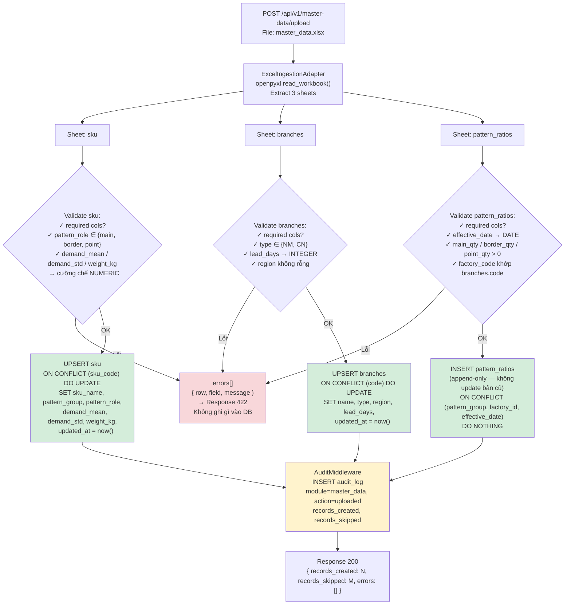

### Pattern Ratio Versioning — Append-only theo `effective_date`

> **Rule:** Mỗi lần tỷ lệ bộ mẫu thay đổi (theo NM, theo tháng) → upload bản mới với `effective_date` mới. DRP Engine luôn lấy bản gần nhất có `effective_date <= today`.

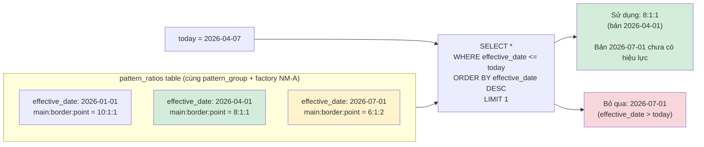

---

## 3. Inventory Data — Từ Excel đến DB (Idempotent)

### Idempotency Design

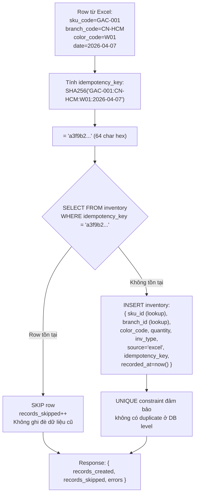

### Inventory Data Fields

| Field | Type | Source | Note |
|-------|------|--------|------|
| `sku_id` | UUID FK | Lookup by `sku_code` | Lỗi nếu sku_code không tồn tại |
| `branch_id` | UUID FK | Lookup by `branch_code` | Lỗi nếu branch_code không tồn tại |
| `quantity` | NUMERIC | Excel column | Giá trị >= 0 |
| `inv_type` | VARCHAR | Excel column | `oem` hoặc `distribution` |
| `color_code` | VARCHAR | Excel column | Màu gốm |
| `is_factory_empty` | BOOLEAN | Manual flag | `PATCH /inventory/:id/factory-empty` |
| `idempotency_key` | VARCHAR UNIQUE | SHA-256 computed | Prevent duplicate sync |
| `source` | VARCHAR | Set by adapter | `excel` \| `bravo_api` |
| `recorded_at` | TIMESTAMP | `now()` | Thời điểm ghi nhận |

### FR08 — Phân biệt Tồn OEM và Tồn Phân phối (prd.md §Ràng buộc Tồn Nhà máy)

| Loại tồn | `inv_type` | Định nghĩa | Độ tin cậy |
|----------|-----------|------------|------------|
| **Tồn OEM** | `oem` | UNIS đặt NM sản xuất riêng | Số chính xác — NM cung cấp đủ visibility |
| **Tồn Phân phối** | `distribution` | NM sản xuất cho nhiều bên | Số ước tính — NM không cung cấp số thật cho UNIS |

**Rule:** UI phải hiển thị badge phân biệt rõ 2 loại ("Chính xác" vs "Ước tính"). Khi NM hết hàng OEM → Planner xác nhận thủ công `is_factory_empty = true` — hệ thống không tự động hủy đơn (FR10).

---

## 4. DRP Compute — Từ DB đến DRP Results

### Data Read Phase

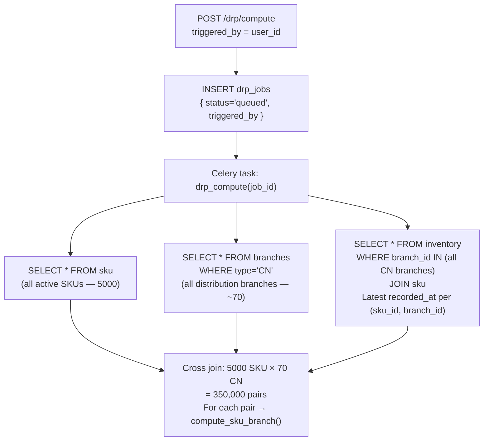

### Compute Phase (Per SKU × Branch Pair)

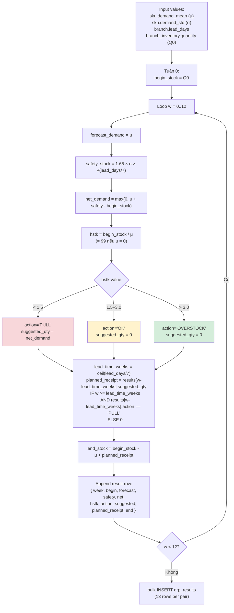

### Write Phase

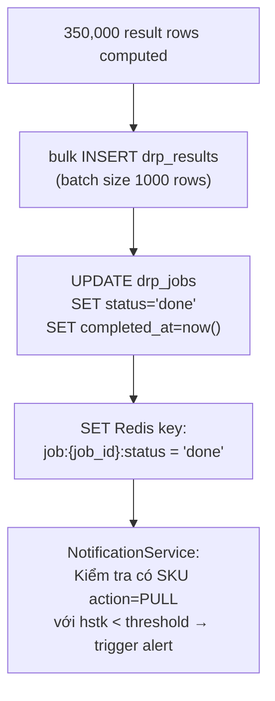

### DRP Results Schema

| Field | Type | Mô tả |
|-------|------|--------|
| `job_id` | UUID FK | Link về drp_jobs |
| `sku_id` | UUID FK | SKU được tính |
| `branch_id` | UUID FK | CN được tính |
| `week` | INTEGER (0-12) | Tuần trong 13-week horizon |
| `begin_stock` | NUMERIC | Tồn đầu tuần |
| `forecast_demand` | NUMERIC | = `sku.demand_mean` |
| `safety_stock` | NUMERIC | 1.65 × σ × √(L/7) |
| `net_demand` | NUMERIC | max(0, forecast + safety - begin) |
| `hstk` | NUMERIC | begin / forecast |
| `action` | VARCHAR | `PULL` \| `OK` \| `OVERSTOCK` |
| `suggested_qty` | NUMERIC | net_demand nếu PULL, else 0 |
| `planned_receipt` | NUMERIC | Nhận hàng dự kiến từ lệnh trước |
| `end_stock` | NUMERIC | begin - forecast + planned_receipt |

---

## 5. Pull Order — Từ DRP Result đến Approved Order

### Data Transformation Pipeline

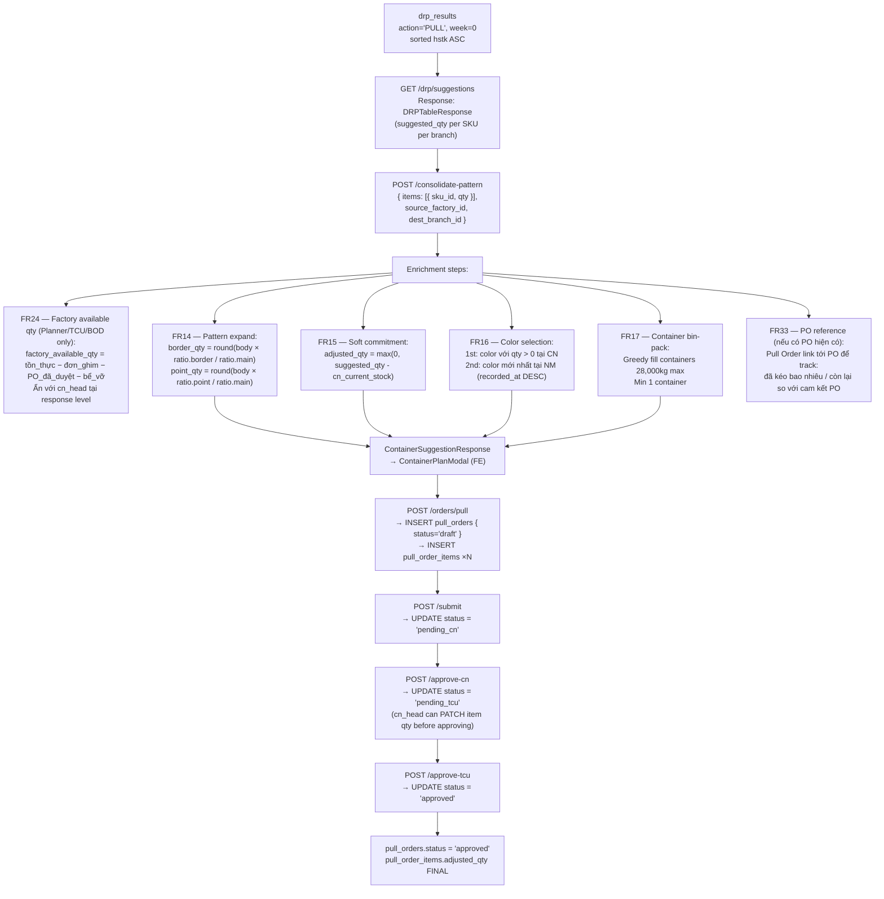

### Order Item Data Flow

| Stage | `suggested_qty` | `adjusted_qty` | Actor | Source |
|-------|----------------|----------------|-------|--------|
| From DRP | `net_demand` | = `suggested_qty` | — | drp_results |
| After consolidate (FR15) | unchanged | `max(0, suggested - cn_stock)` | System | Backend service |
| After CN adjustment (FR29) | unchanged | User input | `cn_head` | `PATCH /items/:id` |
| After TCU adjustment (FR32) | unchanged | User input + reason | `vpt_head` | `PATCH /items/:id` |
| Approved | unchanged | **Final value** | — | Locked |

---

## 6. Audit Trail — Mọi mutation đều được ghi

Mọi request `POST`/`PATCH`/`DELETE` đi qua `AuditMiddleware` → tự động INSERT vào `audit_log`.

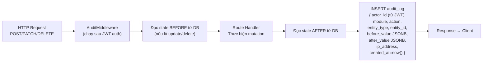

### Audit Log Schema

| Field | Ví dụ | Note |
|-------|-------|------|
| `actor_id` | `uuid-user-123` | Từ JWT token |
| `module` | `orders` \| `master_data` \| `inventory` \| `drp` | |
| `action` | `POST` \| `PATCH` \| `DELETE` | HTTP method |
| `entity_type` | `pull_order` \| `sku` \| `inventory` | |
| `entity_id` | `uuid-order-456` | |
| `before_value` | `{"status": "draft"}` | JSONB — null nếu CREATE |
| `after_value` | `{"status": "pending_cn"}` | JSONB |
| `ip_address` | `10.0.0.42` | |
| `created_at` | `2026-04-07T10:30:00` | |

> ⚠️ **Append-only constraint:** Không có `UPDATE` hoặc `DELETE` nào được phép trên bảng `audit_log` ở DB level. Enforced bằng PostgreSQL trigger hoặc revoke privilege.

---

## 7. Data Model Relationships

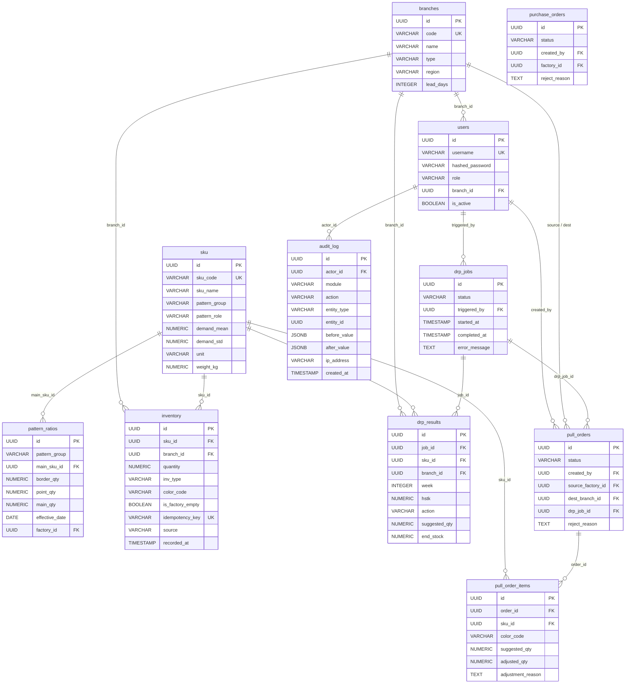

---

## 8. Data Validation Rules

### Master Data

| Rule | Field | Constraint |
|------|-------|-----------|
| `pattern_role` chỉ 3 giá trị | `sku.pattern_role` | `IN ('main', 'border', 'point')` |
| `branch.type` chỉ NM/CN | `branches.type` | `IN ('NM', 'CN')` |
| `demand_mean >= 0` | `sku.demand_mean` | `CHECK demand_mean >= 0` |
| `lead_days > 0` | `branches.lead_days` | `CHECK lead_days > 0` |
| `effective_date` là ngày hợp lệ | `pattern_ratios.effective_date` | `DATE format YYYY-MM-DD` |
| Pattern ratio: lấy bản mới nhất | `pattern_ratios` | `effective_date <= today ORDER BY DESC LIMIT 1` |

### Inventory

| Rule | Detail |
|------|--------|
| `inv_type` | `IN ('oem', 'distribution')` |
| `quantity >= 0` | Không có tồn kho âm |
| `idempotency_key` UNIQUE | Ngăn duplicate insert tuyệt đối |
| `sku_code` phải tồn tại | Foreign key check → error nếu không match |
| `branch_code` phải tồn tại | Foreign key check → error nếu không match |

### Pull Order

| Rule | Detail |
|------|--------|
| Status machine | Chỉ được chuyển theo thứ tự: draft→pending_cn→pending_tcu→approved |
| `reject_reason` bắt buộc | `len(reject_reason.strip()) > 0` khi reject |
| CN rejection FINAL | Không thể undo, không thể escalate (FR30) |
| `adjusted_qty >= 0` | Không cho phép qty âm khi CN adjust |
| `cn_head` scoping | `branch_id` trong JWT phải match `dest_branch_id` của order |

### DRP Algorithm

| Rule | Detail |
|------|--------|
| `hstk = 99` khi `demand_mean = 0` | Tránh chia cho 0 |
| Pattern ratio NOT applied to forecast | `forecast_demand = sku.demand_mean` — ratio chỉ dùng khi tạo Pull Order |
| `safety_stock` dựa trên `lead_days` | North: 14 days → 2 weeks; South: 3 days → 0.43 weeks |
| `planned_receipt` lookback | Chỉ nhận hàng từ tuần có action=PULL, cách `lead_time_weeks` tuần |

---

## 9. Data Lifecycle — Vòng đời dữ liệu

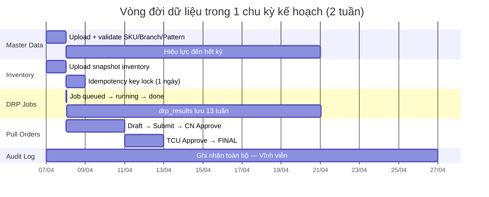

### Retention Policy (đề xuất)

| Table | Giữ bao lâu | Lý do |
|-------|------------|-------|
| `drp_results` | 3 tháng (90 ngày) | Phân tích xu hướng HSTK |
| `drp_jobs` | 3 tháng | Tracking job history |
| `inventory` | Vĩnh viễn | Source of truth + idempotency |
| `pull_orders` + items | Vĩnh viễn | Compliance + truy xuất |
| `purchase_orders` | Vĩnh viễn | Compliance |
| `audit_log` | Vĩnh viễn, append-only | Immutable — không xóa |
| `sku` / `branches` | Vĩnh viễn | Master data |

### Data Dependencies (thứ tự cần thiết khi init)

```
1. branches (cần trước inventory, trước pull_orders)
2. sku (cần trước inventory, trước drp_results, trước pull_order_items)
3. users (cần trước drp_jobs, trước pull_orders, trước audit_log)
4. pattern_ratios (cần sau sku + branches)
5. inventory (cần sau sku + branches)
6. drp_jobs + drp_results (cần sau sku + branches + inventory)
7. pull_orders + pull_order_items (cần sau drp_results + branches + sku + users)
8. purchase_orders (cần sau users + branches)
```

---

*data-flow.md v1.1 — TerraX DRP Production | 2026-04-07 | Validated against prd.md + epics.md + HANDOVER-DEV.md*
