# TerraX DRP — System Flows

> **Version:** 1.0 | **Date:** 2026-04-07
> **Source:** Derived from `architecture.md`, `API-DOCS.md`, `FRONTEND-DOCS.md`
> **Purpose:** Reference cho dev, QA, và architect để hiểu luồng kỹ thuật chi tiết của toàn hệ thống.

---

## Mục lục

1. [Kiến trúc tổng thể](#1-kiến-trúc-tổng-thể)
2. [Authentication Flow](#2-authentication-flow)
3. [Data Ingestion Flow](#3-data-ingestion-flow)
4. [DRP Engine — Async Compute Flow](#4-drp-engine--async-compute-flow)
5. [Pull Order — Tạo và Approval Flow](#5-pull-order--tạo-và-approval-flow)
6. [Purchase Order Flow](#6-purchase-order-flow)
7. [RBAC — Phân quyền theo Role](#7-rbac--phân-quyền-theo-role)
8. [DRP Algorithm — Logic cốt lõi](#8-drp-algorithm--logic-cốt-lõi)

---

## 1. Kiến trúc tổng thể

Hệ thống gồm 6 lớp độc lập: Frontend → Nginx → FastAPI (+ Middleware) → Celery Worker → PostgreSQL + Redis.

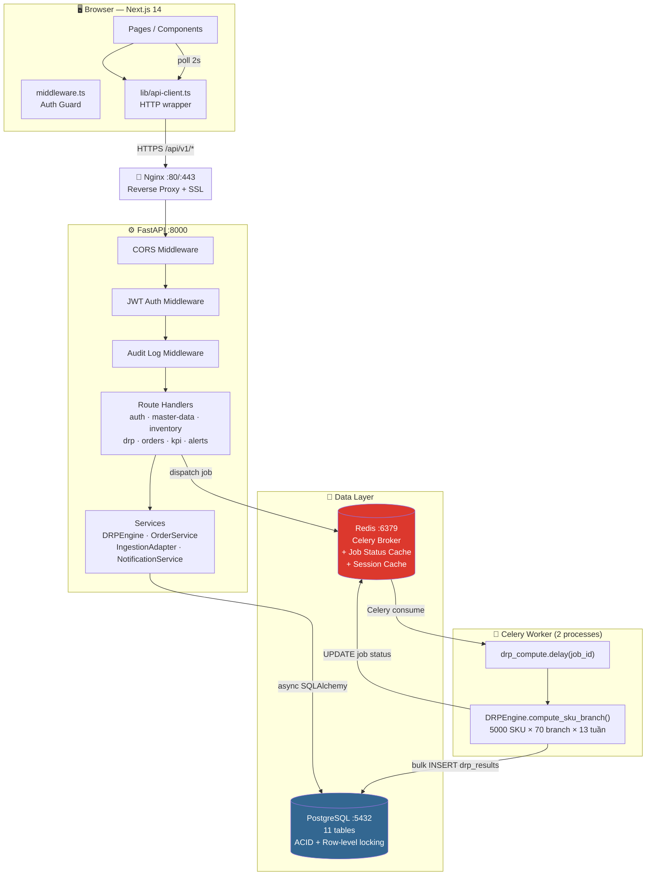

**Docker Compose services:**

| Service | Port | Role |
|---------|------|------|
| `nginx` | 80/443 | Reverse proxy, SSL termination |
| `frontend` | 3000 | Next.js (SSR + Client components) |
| `backend` | 8000 | FastAPI, 2 workers |
| `worker` | — | Celery worker, 2 processes |
| `postgres` | 5432 | Primary database |
| `redis` | 6379 | Broker + cache |

---

## 2. Authentication Flow

**Middleware chain:** `Next.js middleware.ts` (client) → `JWT Middleware` (server)

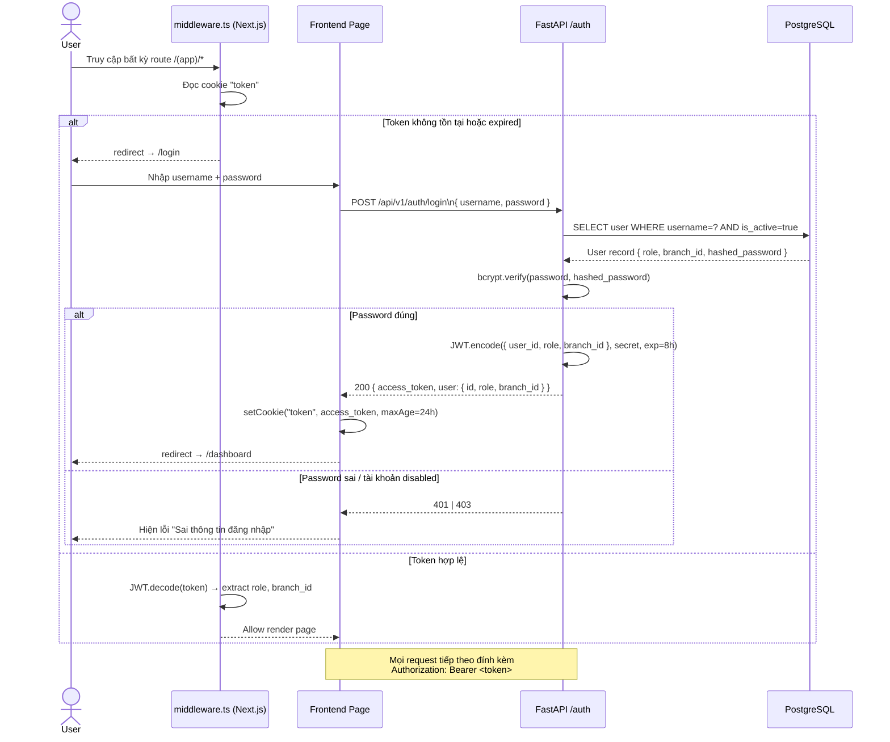

**Refresh token:**

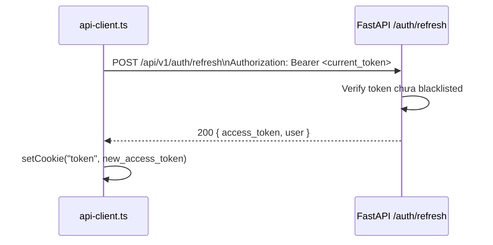

**Quy tắc RBAC tại backend:** Mọi protected route dùng `@require_permission("permission_name")` decorator. Token không có quyền → `403 Forbidden`.

---

## 3. Data Ingestion Flow

### 3A. Master Data Upload

**Actor:** `vpt_planner` | **File:** `.xlsx` với 3 sheets: `sku`, `branches`, `pattern_ratios`

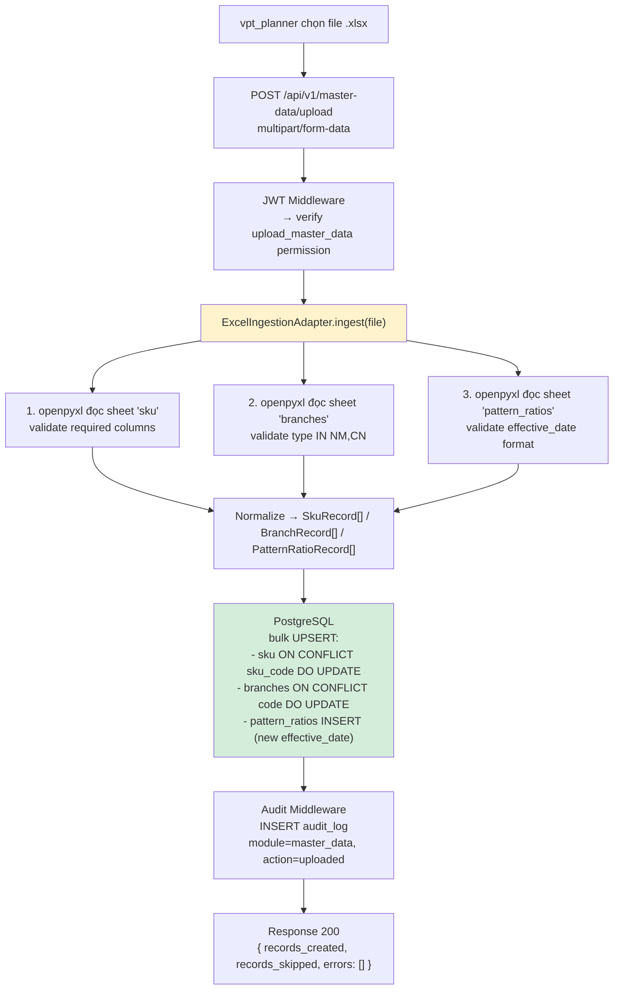

### 3B. Inventory Upload

**Actor:** `vpt_planner` | **Header bắt buộc:** `Idempotency-Key`

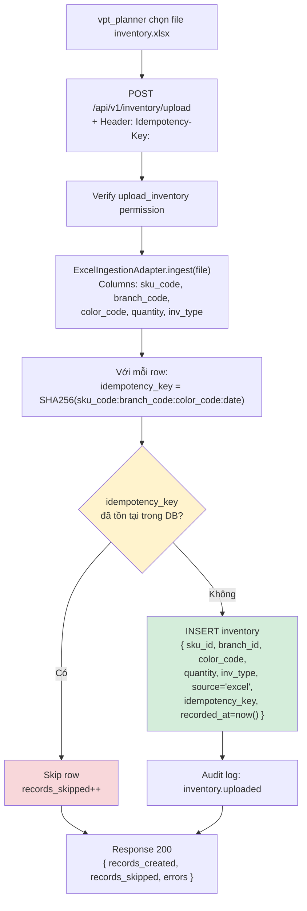

### 3C. Adapter Pattern — Extensibility

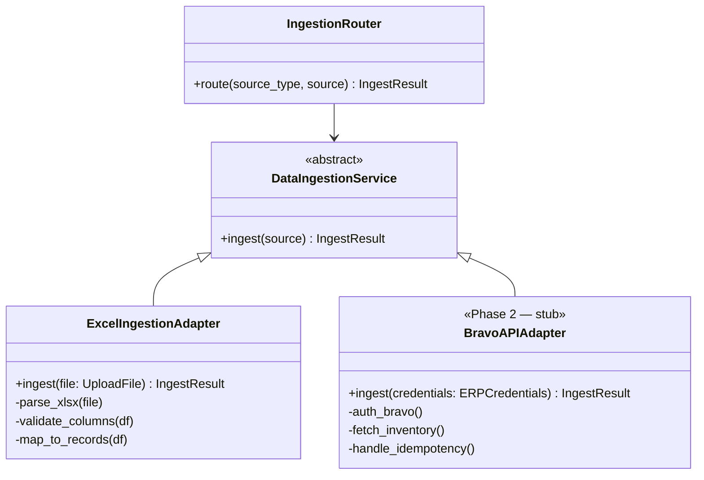

> **Rule:** Business logic không bao giờ biết nguồn dữ liệu là Excel hay ERP. Chỉ adapter biết.

---

## 4. DRP Engine — Async Compute Flow

**Actor:** `vpt_planner` hoặc `vpt_head` | **Cơ chế:** Celery + Redis (async job)

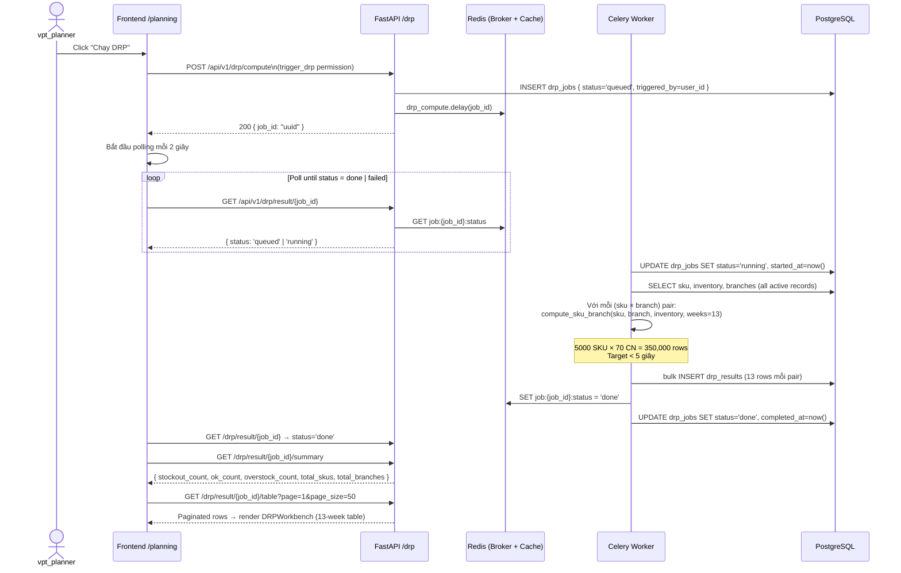

**Page load optimization:**

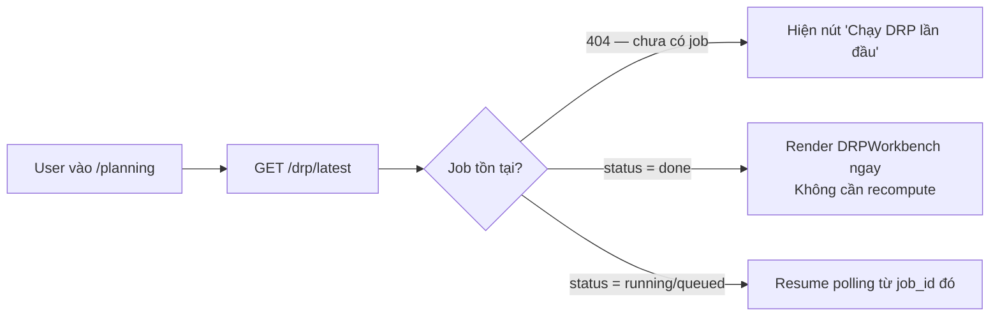

---

## 5. Pull Order — Tạo và Approval Flow

### 5A. State Machine

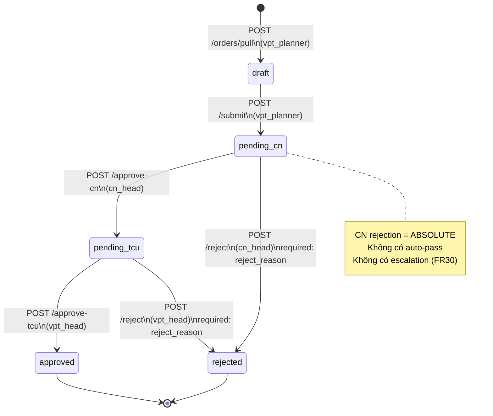

### 5B. Pull Order Creation — Sprint 2 Flow (FR14-FR17)

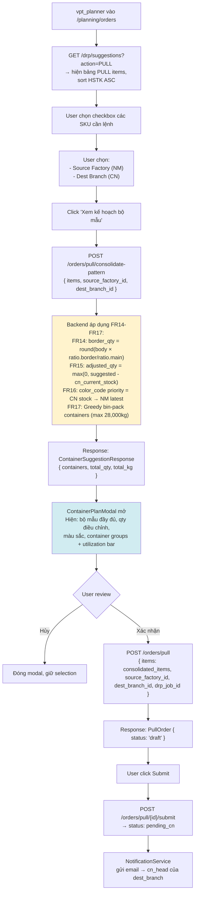

**Business rules bổ sung tại bước tạo Pull Order:**

| Rule | FR | Detail |
|------|----|--------|
| Factory available qty | FR24 | `factory_available_qty = tồn_thực − đơn_ghim − PO_đã_duyệt − bể_vỡ` — hiển thị cho planner/vpt_head/bod, ẩn với cn_head |
| Planner adjust individual SKU | FR21 | Planner có thể sửa qty từng SKU tự do — các SKU còn lại trong cùng bộ mẫu **giữ nguyên**, không tự tính lại |
| PO reference | FR33 | Nếu có PO hiện có → Pull Order tham chiếu PO đó để theo dõi: đã kéo / còn lại so với cam kết |

### 5C. CN Head Approval — FR28, FR29, FR30

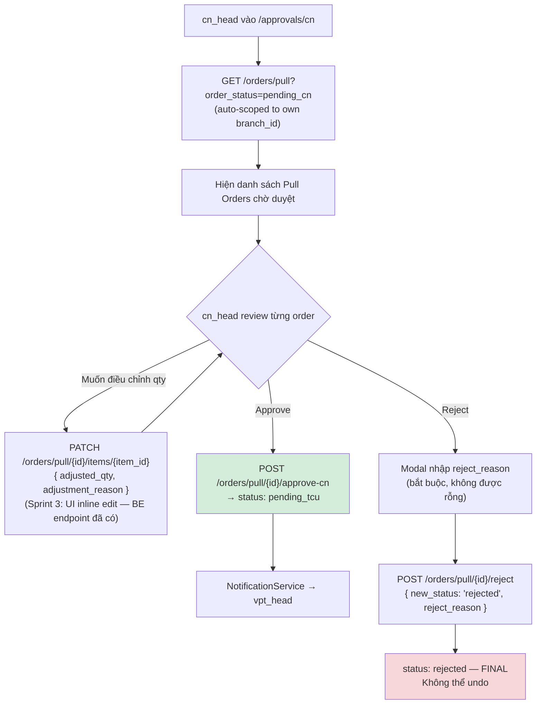

### 5D. TCU Final Approval — FR31, FR32, FR33

```mermaid
flowchart TD
    A["vpt_head vào /approvals/tcu"] --> B["GET /orders/pull?order_status=pending_tcu\n(toàn bộ branches — không scoped)"]
    B --> C["Danh sách Pull Orders đã qua CN\nHighlight lệnh bất thường (SL > 40% avg 4 tuần)"]
    C --> D{TCU review}

    D -->|Xem chi tiết| E["Xem: factory_available_qty, unit_price\nCN head notes, adjusted_qty\nPO reference: đã kéo / còn lại (FR33)"]

    D -->|Bulk approve bình thường| F["Multi-select checkbox\n→ POST /approve-tcu (bulk)\n→ status: approved ✅"]

    D -->|Điều chỉnh SL trước khi duyệt (FR32)| G["Inline edit qty + nhập lý do bắt buộc\nAudit log: before/after + reason"]
    G --> F

    D -->|Reject| H["Nhập reject_reason\n→ POST /reject\n→ status: rejected ❌ (FINAL)"]

    F --> I["Audit log: actor=vpt_head, action=order.final_approved"]
    H --> I

    style F fill:#d4edda
    style H fill:#f8d7da
```

> **FR32:** TCU không chỉ approve/reject — có thể **điều chỉnh số lượng** Pull Order Items trước khi duyệt cuối. Audit log ghi trước/sau + lý do.

---

## 6. Purchase Order Flow

> **PO = "Cam kết mềm" (FR23, prd.md §Phân loại Chứng từ):** PO là tín hiệu để NM lên kế hoạch sản xuất — **không phải cam kết pháp lý**, không phát sinh công nợ. NM tham chiếu PO để sắp xếp lịch; không ràng buộc bên nào. Khác với Pull Order là kéo thật hàng vật lý.

### State Machine

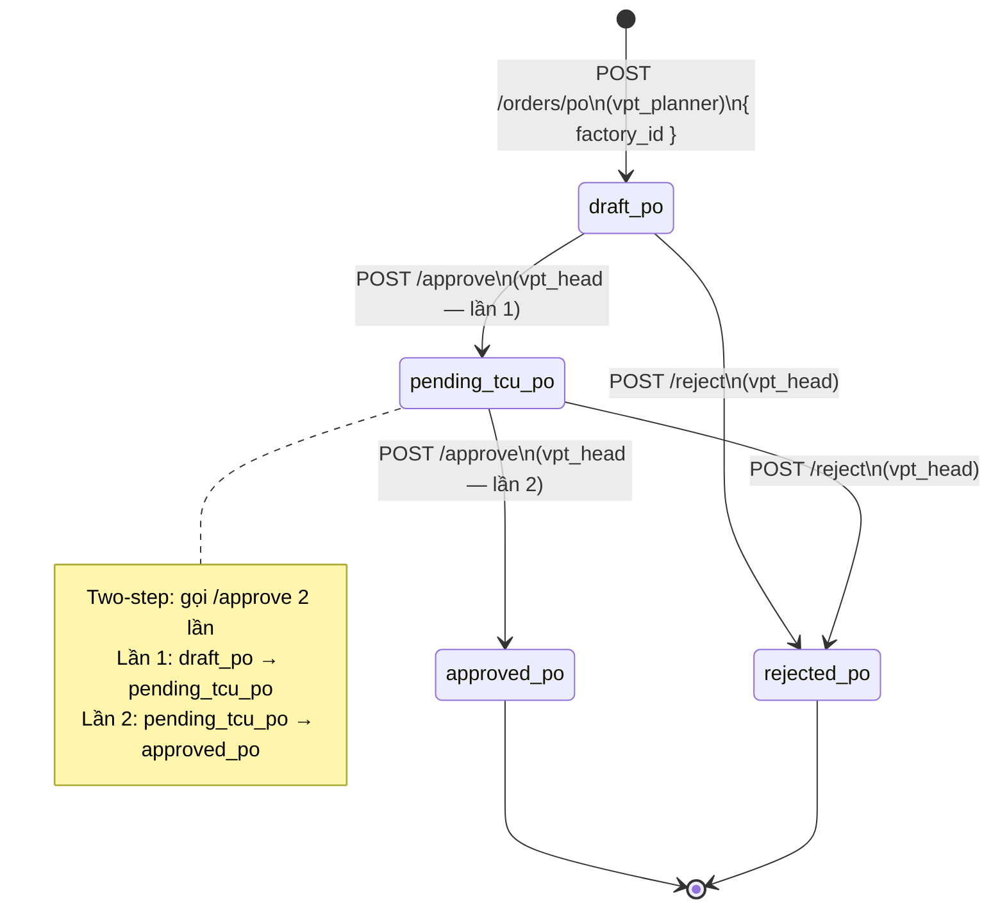

---

## 7. RBAC — Phân quyền theo Role

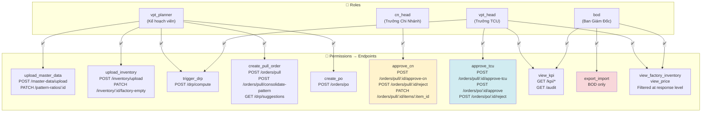

**Critical RBAC rules:**

| Rule | Detail |
|------|--------|
| `cn_head` scoping | Auto-filter theo `branch_id` trên mọi `/orders/pull` và `/inventory` endpoints |
| `cn_head` blind | Không thấy `factory_available_qty` và `unit_price` — backend filter at response level |
| `vpt_head` approve-tcu | Không thể approve lệnh ở `pending_cn` — phải qua CN trước |
| Token vô hiệu | `403 Forbidden` — không redirect, không leak data |

---

## 8. DRP Algorithm — Logic cốt lõi

> **Status: FROZEN** — Đã verify ở demo phase. Không được thay đổi logic.
> **File:** `backend/app/services/drp_engine.py::compute_sku_branch()`

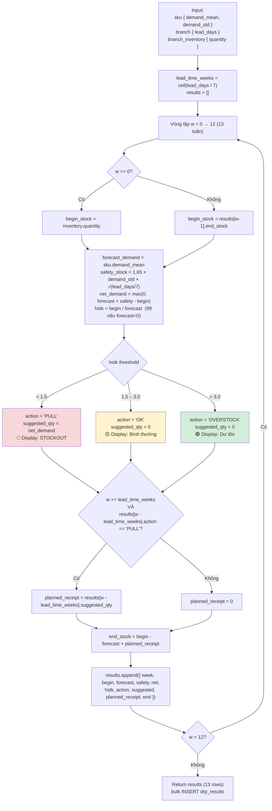

**HSTK Display Rules (bất biến — áp dụng mọi nơi trên FE):**

| DB `action` | Display Label | Badge Color | CSS Var |
|-------------|--------------|-------------|------|
| `PULL` | **STOCKOUT** | 🔴 Red | `var(--color-red)` |
| `OK` | **Bình thường** | 🟡 Yellow | `var(--color-yellow)` |
| `OVERSTOCK` | **Dư tồn** | 🟢 Green | `var(--color-green)` |

> ⚠️ **Threshold conflict note:** `epics.md` coverage map và `HANDOVER-DEV.md` Phase 2 table ghi OVERSTOCK `> 4 tuần`. Tuy nhiên **4 nguồn khác đồng thuận `> 3.0`** (`prd.md FR35`, `epics.md FR list`, `epics.md Story 3.3`, `architecture.md`). Production sử dụng `> 3.0` — đây là giá trị chính xác. Giá trị `> 4` là lỗi trong coverage map.

> ⚠️ **Forbidden pattern:** Không bao giờ render raw `action` string ("PULL"/"OK"/"OVERSTOCK") trực tiếp ra UI. Luôn dùng `<HSTKBadge action={action} hstk={hstk} />`.

**Pattern Consolidation (CHỈ khi tạo Pull Order — không áp dụng cho forecast):**

```python
border_qty = round(body_qty * ratio.border_qty / ratio.main_qty)
point_qty  = round(body_qty * ratio.point_qty  / ratio.main_qty)
```

---

*system-flows.md v1.1 — TerraX DRP Production | 2026-04-07 | Validated against prd.md + epics.md + HANDOVER-DEV.md*
