# UNIS SCP — User Flow

> **Version:** 2.0 | **Date:** 2026-04-13
> **Source:** `UNIS-TERRAX-MAPPING.md`, `data-flow.md`, `system-flows.md`, `SCP v3.6`
> **Purpose:** Mô tả hành trình từng role người dùng qua 8-step SCP pipeline — dùng cho UX review, QA test case, onboarding.
> **Migrated from:** TerraX DRP user-flow v1.0

---

## Mục lục

1. [Tổng quan 8-step SCP Pipeline](#1-tổng-quan-8-step-scp-pipeline)
2. [Roles và quyền truy cập](#2-roles-và-quyền-truy-cập)
3. [User Flow — sc_planner (Kế hoạch viên SC)](#3-user-flow--sc_planner-kế-hoạch-viên-sc)
4. [User Flow — branch_head (Trưởng Chi Nhánh)](#4-user-flow--branch_head-trưởng-chi-nhánh)
5. [User Flow — sc_manager (Trưởng bộ phận SCM)](#5-user-flow--sc_manager-trưởng-bộ-phận-scm)
6. [User Flow — bod (Ban Giám Đốc)](#6-user-flow--bod-ban-giám-đốc)
7. [Happy Path — Luồng hoàn chỉnh 1 PlanningCycle](#7-happy-path--luồng-hoàn-chỉnh-1-planningcycle)
8. [Error & Edge Case Flows](#8-error--edge-case-flows)

---

## 1. Tổng quan 8-step SCP Pipeline

| Step | Module | Route | Trigger | Output |
|------|--------|-------|---------|--------|
| **S1** | Demand Ingestion | `/demand` | PlanningCycle (23:00 ICT) hoặc manual | `demand_signal[]` đã clean, Freshness Gate PASS |
| **S2** | Supply Snapshot | `/supply` | Sau S1 PASS | `inventory_snapshot` (4-bucket: OEM/Transit/Buffer/Committed) |
| **S3** | Inventory & Policy | `/policy` | Sau S2 | `safety_stock`, `reorder_point`, ABC/XYZ class per SKU |
| **S4** | DRP Netting | `/drp` | Sau S3 | `net_requirement[]`, lot-sized pull suggestions |
| **S5** | Allocation Engine | `/allocation` | Sau S4 | `allocation_plan` (6-layer: VIP→OEM→RDC→SS→Excess→Backlog) |
| **S6** | Transport Planning | `/transport` | Sau S5 | `shipment_plan` (vehicle + carrier assignment) |
| **S7** | Order Bridge | `/execution` | Manual trigger sau S6 approved | SO/TO/PO pushed → Bravo ERP |
| **S8** | Monitor & Learn | `/monitor` | Continuous / post-cycle | KPI drift, MAPE, Fill Rate, OTIF alert |

> **PlanningCycle:** chạy tự động 23:00 ICT hàng ngày → S1→S2→S3→S4 pipeline auto. S5-S7 yêu cầu human-in-the-loop approval.

---

## 2. Roles và quyền truy cập

| Route | sc_planner | branch_head | sc_manager | bod |
|-------|:----------:|:-----------:|:----------:|:---:|
| `/` (Exception Dashboard) | ✅ | ✅ (branch-scoped) | ✅ full | ✅ full |
| `/demand` | ✅ + trigger | ✅ view | ✅ + override | ✅ view |
| `/supply` | ✅ + upload | ✅ own branch | ✅ full | ✅ view |
| `/policy` | ✅ + edit SS | ✅ view | ✅ + approve | ✅ view |
| `/drp` | ✅ + trigger | ✅ view | ✅ + trigger | ✅ view |
| `/allocation` | ✅ + adjust | ✅ view own layer | ✅ + approve | ✅ view |
| `/transport` | ✅ + plan | ❌ | ✅ + approve | ✅ view |
| `/execution` | ✅ + submit | ✅ approve SO | ✅ approve PO/TO | ✅ view |
| `/monitor` | ✅ view | ✅ view (branch) | ✅ full | ✅ full |
| `/plan-actual` | ✅ view | ✅ view (branch) | ✅ full | ✅ full |
| `/config` | ❌ | ❌ | ✅ edit | ✅ view |

> **Note:** `branch_head` chỉ thấy dữ liệu scoped theo `branch_id` của mình. Không thấy `factory_available_qty`, `unit_price`, cross-branch allocation detail.

---

## 3. User Flow — sc_planner (Kế hoạch viên SC)

Role trung tâm — điều hành toàn bộ 8 bước SCP pipeline hàng ngày.

### 3A. Luồng sáng sớm — Kiểm tra PlanningCycle

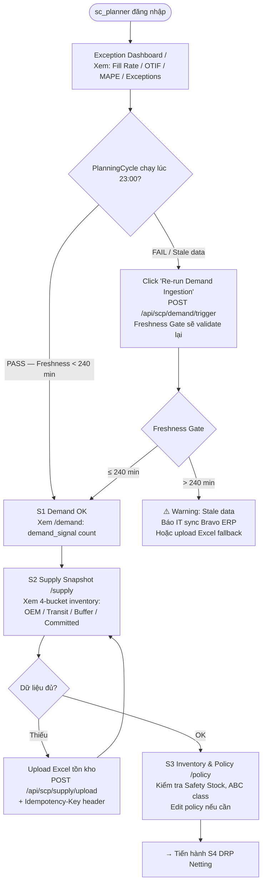

### 3B. Luồng chạy DRP Netting (S4)

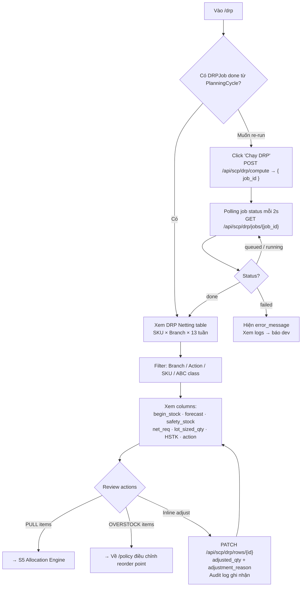

### 3C. Luồng Allocation Engine (S5)

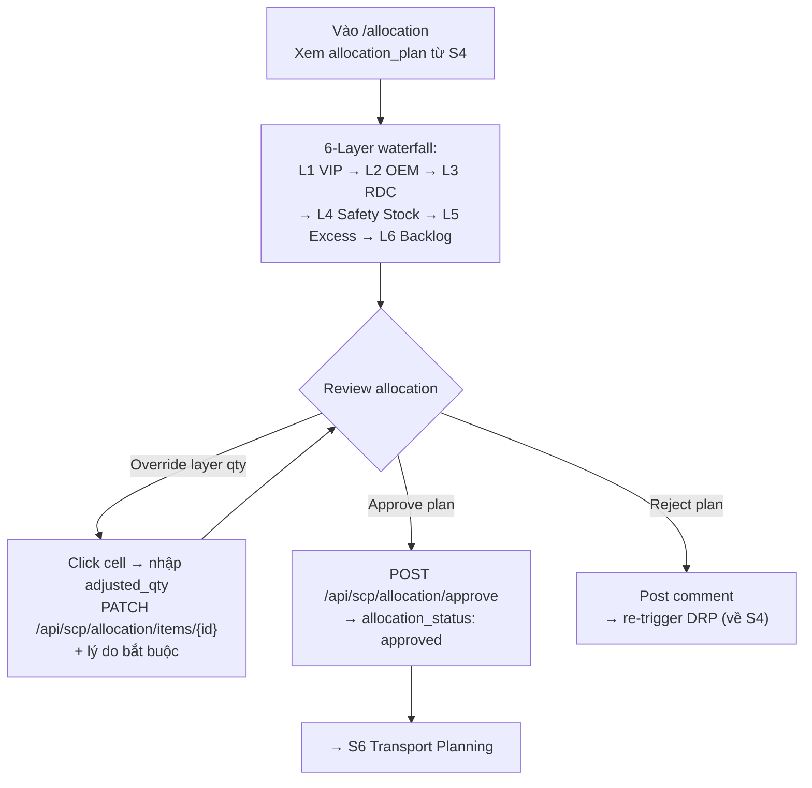

### 3D. Luồng Transport Planning → Order Bridge (S6 → S7)

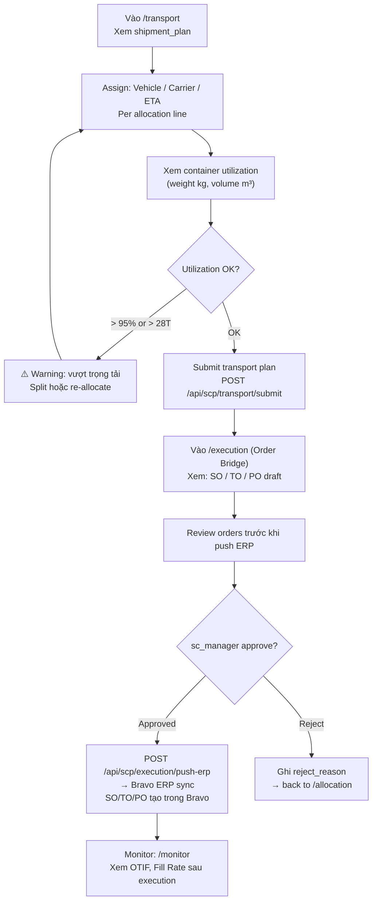

---

## 4. User Flow — branch_head (Trưởng Chi Nhánh)

`branch_head` xem kết quả allocation cho branch mình và duyệt SO trước khi push ERP.

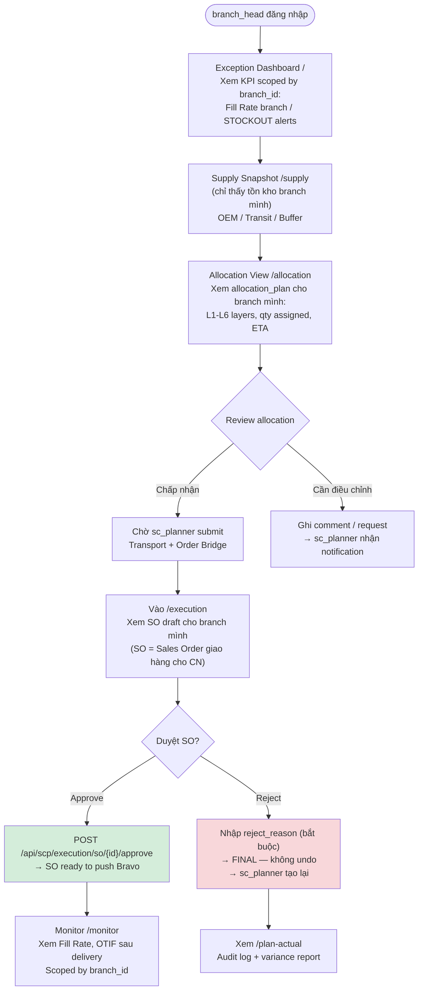

**Constraints quan trọng với `branch_head`:**

- Data luôn scoped theo `branch_id` — không thấy cross-branch info
- Không thấy `factory_available_qty`, `unit_price`, allocation của branch khác
- SO rejection là FINAL — không escalate, sc_planner phải tạo lại
- Không có quyền trigger PlanningCycle hay DRP

---

## 5. User Flow — sc_manager (Trưởng bộ phận SCM)

`sc_manager` là người duyệt cuối toàn pipeline — xem đầy đủ inventory, approve PO/TO/SO, và quản lý Policy Platform.

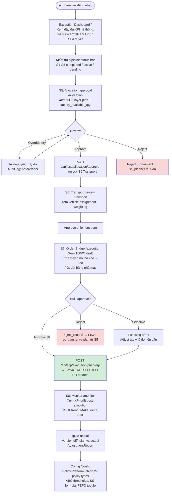

---

## 6. User Flow — bod (Ban Giám Đốc)

`bod` view-only trên toàn pipeline. Có thêm quyền export JSON snapshot.

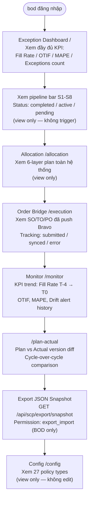

---

## 7. Happy Path — Luồng hoàn chỉnh 1 PlanningCycle

Một chu kỳ kế hoạch hoàn chỉnh từ S1 Demand Ingestion → S7 Order Bridge push ERP:

```mermaid
sequenceDiagram
    actor P as sc_planner
    actor BH as branch_head
    actor M as sc_manager
    participant SYS as UNIS SCP
    participant ERP as Bravo ERP

    rect rgb(240, 248, 255)
        Note over P,SYS: S1 — Demand Ingestion (23:00 ICT auto)
        SYS->>ERP: Pull demand signal từ Bravo
        SYS->>SYS: Freshness Gate: age ≤ 240 min?
        SYS-->>P: Exception Dashboard: S1 PASS / FAIL
    end

    rect rgb(255, 248, 240)
        Note over P,SYS: S2 — Supply Snapshot
        SYS->>ERP: Pull inventory (OEM/Transit/Buffer/Committed)
        P->>SYS: (Nếu cần) Upload Excel fallback
        SYS-->>P: inventory_snapshot confirmed
    end

    rect rgb(240, 255, 248)
        Note over P,SYS: S3+S4 — Policy & DRP Netting
        P->>SYS: Review safety_stock, reorder_point /policy
        P->>SYS: POST /api/scp/drp/compute
        SYS->>SYS: Compute net_req × lot_size × 13W per SKU×Branch
        SYS-->>P: DRP table: HSTK badges, action=PULL/HOLD/OVERSTOCK
    end

    rect rgb(248, 240, 255)
        Note over P,M,SYS: S5 — Allocation Engine
        P->>SYS: Review 6-layer allocation plan /allocation
        P->>SYS: Adjust qty nếu cần + lý do
        M->>SYS: POST /api/scp/allocation/approve ✅
    end

    rect rgb(255, 252, 240)
        Note over P,SYS: S6 — Transport Planning
        P->>SYS: Assign vehicle / carrier / ETA /transport
        P->>SYS: POST /api/scp/transport/submit
    end

    rect rgb(240, 255, 240)
        Note over P,BH,M,SYS: S7 — Order Bridge
        P->>SYS: Generate SO/TO/PO draft /execution
        BH->>SYS: POST /api/scp/execution/so/{id}/approve (SO)
        M->>SYS: POST /api/scp/execution/push-erp (TO+PO)
        SYS->>ERP: Push SO + TO + PO → Bravo
        ERP-->>SYS: sync_status: success
        SYS->>SYS: Audit log: actor + timestamp + before/after
    end

    rect rgb(255, 240, 240)
        Note over P,M,SYS: S8 — Monitor & Learn
        SYS->>SYS: Compute KPI: Fill Rate, OTIF, MAPE drift
        M->>SYS: Review /monitor — xem exceptions
        P->>SYS: /plan-actual — so sánh plan vs actual
        M->>SYS: /config — điều chỉnh policy cho cycle tiếp
    end
```

---

## 8. Error & Edge Case Flows

### 8A. Freshness Gate FAIL (S1)

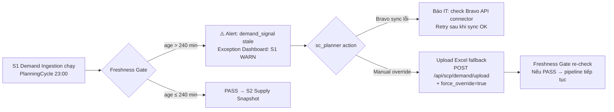

### 8B. Order Bridge bị Reject

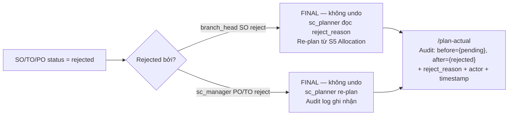

### 8C. Supply Upload Duplicate

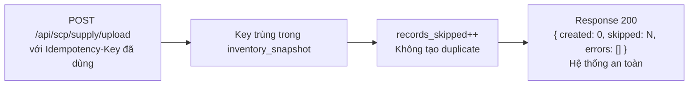

### 8D. DRP Job Failed (S4)

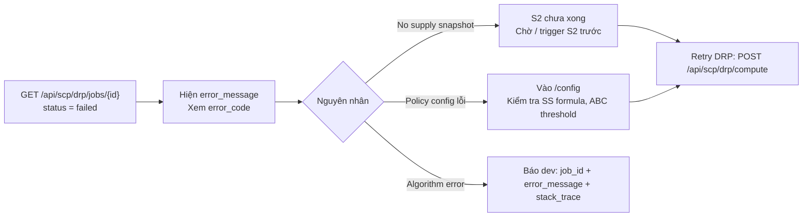

### 8E. Bravo ERP Push Failed (S7)

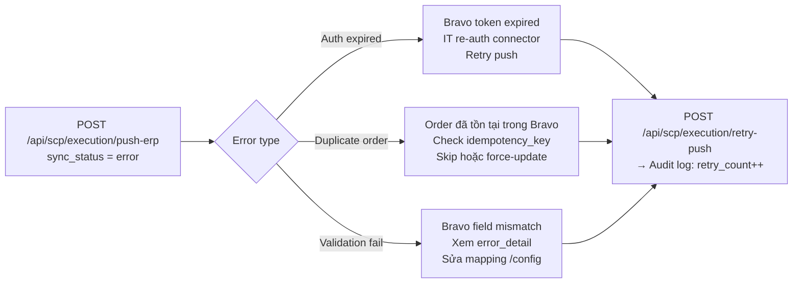

### 8F. User không đủ quyền

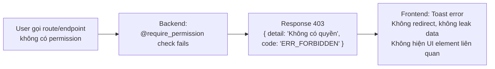

---

*user-flow.md v2.0 — UNIS SCP | 2026-04-13 | Migrated from TerraX DRP v1.1 | Aligned with SCP v3.6 + UNIS-TERRAX-MAPPING.md v1.3*
